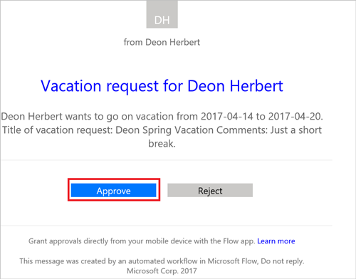
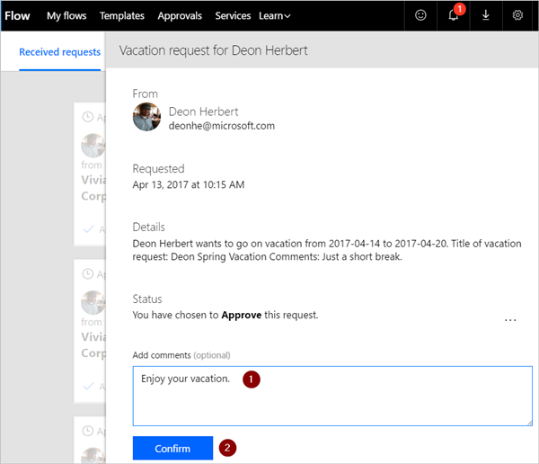
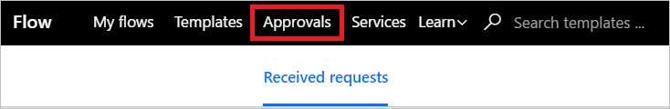
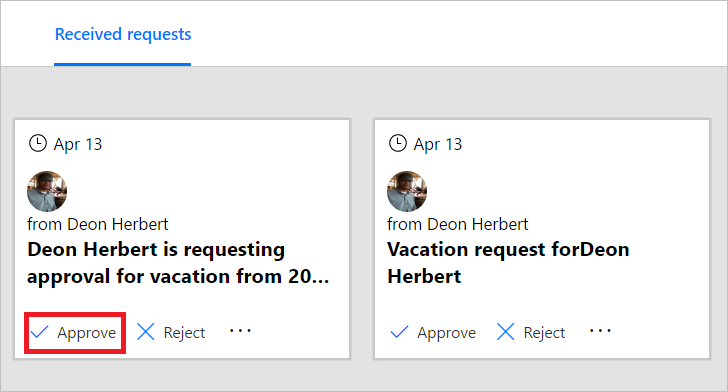
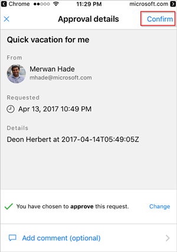
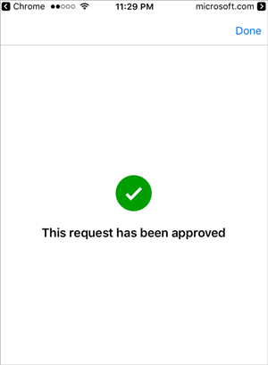

If you're an approver in an approval flow, you receive an email whenever someone creates a request. The approval request is also sent to the approvals center. You can then approve or reject requests from the email, the approvals center, or the Microsoft Flow app.

To approve a request:

### From email

1. Select **Approve** from the email you receive when an item is added to the SharePoint Online list.

     Note: If you're using an Android or iOS mobile phone with the Microsoft Flow app installed, the Microsoft Flow app launches, otherwise, the approvals center opens in your browser.

     

1. Enter a comment, and then select the **Confirm** button.

     

### From the approvals center

1. Sign into [Microsoft Flow](https://flow.microsoft.com).

     

1. Select the **Approvals** tab.

     

1. Select **Approve** on the request you want to approve.

     

1. Add a note, and then select the **Confirm** button.

     

### From the Microsoft Flow app

1. On your mobile phone with the Microsoft Flow app installed, select **Approve** from the request approval email.

1. Select **Confirm** in the upper right corner of the screen.

     

1. The success page shows; this page indicates that your approval has been recorded.

     

Note: The screens on Android and iOS may differ slightly, however, the functionality is the same on both devices.