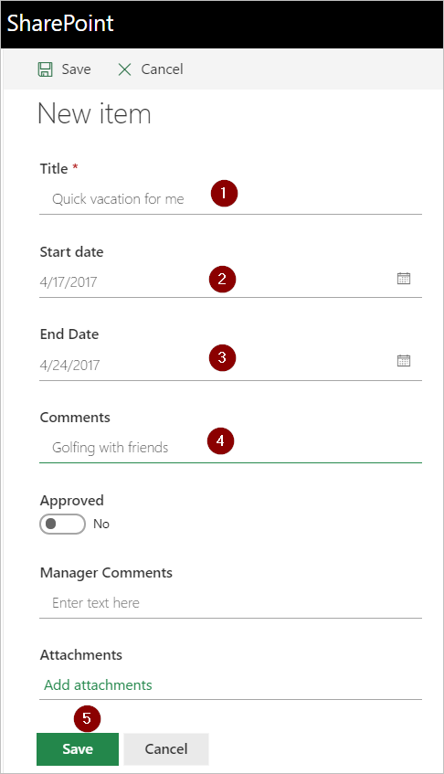

## Request an approval

Create a vacation request in the SharePoint Online list you created earlier.

Your request should resemble this image:

After you save this request, the flow triggers, and then:

1. Creates a request in the approvals center.

1. Sends an approval request email to the approvers.